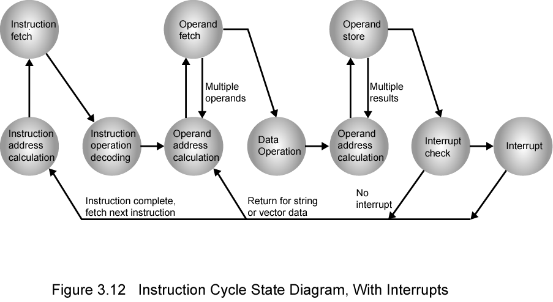

## Top Level View of Computer Function and Interconnection

###### Slides from Computer Organization and Architecture, William Stallings, 8th Edition.  

#HSLIDE

### Program Concept

- Hardwired systems are inflexible
- General purpose hardware can do different tasks, given correct control signals
- Instead of re-wiring, supply a new set of control signals
	
#HSLIDE

### What is a program?

- A sequence of steps
- For each step, an arithmetic or logical operation is done
- For each operation, a different set of control signals is needed

#HSLIDE

### Function of Control Unit

- For each operation a unique code is provided
	- e.g. ADD, MOVE
- A hardware segment accepts the code and issues the control signals
- We have a computer!

#HSLIDE

### Components

- The Control Unit and the Arithmetic and Logic Unit constitute the Central Processing Unit
- Data and instructions need to get into the system and results out
	- Input/output
- Temporary storage of code and results is needed
	- Main memory

#HSLIDE

###Computer Components: Top Level View

<!-- -->

#HSLIDE

### Instruction Cycle

- Two steps:
	- Fetch
	- Execute

#HSLIDE

### Fetch Cycle

- Program Counter (PC) holds address of next instruction to fetch
- Processor fetches instruction from memory location pointed to by PC
- Increment PC
	- Unless told otherwise
- Instruction loaded into Instruction Register (IR)
- Processor interprets instruction and performs required actions

#HSLIDE

### Execute Cycle

- Processor-memory
	- Data transfer between CPU and main memory
- Processor I/O
	- Data transfer between CPU and I/O module
- Data processing
	- Some arithmetic or logical operation on data
- Control
	- Alteration of sequence of operations (e.g. jump)
- Combination of above

#HSLIDE

### Example of Program Execution

#HSLIDE

### Instruction Cycle State Diagram

#HSLIDE

### Interrupts

- Mechanism by which other modules (e.g. I/O) may interrupt normal sequence of processing
- Program (e.g. overflow, division by zero)
- Timer
	- Generated by internal processor timer
	- Used in pre-emptive multi-tasking
- I/O
	- from I/O controller
- Hardware failure (e.g. memory parity error)

#HSLIDE

### Program Flow Control

#HSLIDE

#### Interrupt Cycle

- Added to instruction cycle
- Processor checks for interrupt
	- Indicated by an interrupt signal
- If no interrupt, fetch next instruction

#HSLIDE

#### Interrupt Cycle (cont)

- If interrupt pending:
	- Suspend execution of current program 
	- Save context
	- Set PC to start address of interrupt handler routine
	- Process interrupt
	- Restore context and continue interrupted program

#HSLIDE

### Transfer of Control via Interrupts

#HSLIDE

### Instruction Cycle with Interrupts

#HSLIDE

#### Instruction Cycle (with Interrupts) -  State Diagram

	
#HSLIDE

### Multiple Interrupts

- Disable interrupts
	- Processor will ignore further interrupts whilst processing one interrupt
	- Interrupts remain pending and are checked after first interrupt has been processed
	- Interrupts handled in sequence as they occur
	
#HSLIDE

### Multiple Interrupts (cont)

- Define priorities
	- Low priority interrupts can be interrupted by higher priority interrupts
	- When higher priority interrupt has been processed, processor returns to previous interrupt
	
#HSLIDE

### Multiple Interrupts - Sequential

#HSLIDE

### Multiple Interrupts – Nested

#HSLIDE

### Time Sequence of Multiple Interrupts

#HSLIDE

### Connecting

- All the units must be connected
- Different type of connection for different type of unit
	- Memory
	- Input/Output
	- CPU

#HSLIDE

### Memory Connection

- Receives and sends data
- Receives addresses (of locations)
- Receives control signals 
	- Read
	- Write
	- Timing
	
#HSLIDE

### Input/Output Connection

- Similar to memory from computer’s viewpoint
- Output
	- Receive data from computer
	- Send data to peripheral
- Input
	- Receive data from peripheral
	- Send data to computer

#HSLIDE

### Input/Output Connection(cont)

- Receive control signals from computer
- Send control signals to peripherals
	- e.g. spin disk
- Receive addresses from computer
	- e.g. port number to identify peripheral
- Send interrupt signals (control)

#HSLIDE

### CPU Connection

- Reads instruction and data
- Writes out data (after processing)
- Sends control signals to other units
- Receives (& acts on) interrupts

#HSLIDE

### Buses

- There are a number of possible interconnection systems
- Single and multiple BUS structures are most common
	- e.g. Control/Address/Data bus (PC)
	- e.g. Unibus (DEC-PDP)

#HSLIDE

### What is a Bus?

- A communication pathway connecting two or more devices
- Usually broadcast 
- Often grouped
	- A number of channels in one bus
	- e.g. 32 bit data bus is 32 separate single bit channels
- Power lines may not be shown

#HSLIDE

### Data Bus

- Carries data
	- Remember that there is no difference between “data” and “instruction” at this level
- Width is a key determinant of performance
	- 8, 16, 32, 64 bit

#HSLIDE

### Address bus

- Identify the source or destination of data
	- e.g. CPU needs to read an instruction (data) from a given location in memory
- Bus width determines maximum memory capacity of system
	- e.g. 8080 has 16 bit address bus giving 64k address space

#HSLIDE

### Control Bus

- Control and timing information
	- Memory read/write signal
	- Interrupt request
	- Clock signals

#HSLIDE

### Bus Interconnection Scheme

	
#HSLIDE

### Big and Yellow?

- What do buses look like?
	- Parallel lines on circuit boards
	- Ribbon cables
	- Strip connectors on mother boards
		- e.g. PCI
	- Sets of wires
	
#HSLIDE

### Physical Realization of Bus Architecture

#HSLIDE

### Single Bus Problems

- Lots of devices on one bus leads to:
	- Propagation delays
		- Long data paths mean that co-ordination of bus use can adversely affect performance
		- If aggregate data transfer approaches bus capacity
- Most systems use multiple buses to overcome these problems

#HSLIDE

### Traditional (ISA) - with cache

#HSLIDE

### High Performance Bus

#HSLIDE

### Bus Types

- Dedicated
	- Separate data & address lines
- Multiplexed
	- Shared lines
	- Address valid or data valid control line
	- Advantage - fewer lines
	- Disadvantages
		- More complex control
		- Ultimate performance

#HSLIDE

### Bus Arbitration

- More than one module controlling the bus
	- e.g. CPU and DMA controller
- Only one module may control bus at one time
- Arbitration may be centralised or distributed

#HSLIDE

### Centralised or Distributed Arbitration

- Centralised
	- Single hardware device controlling bus access
		- Bus Controller
		- Arbiter
	- May be part of CPU or separate
- Distributed
	- Each module may claim the bus	
	- Control logic on all modules

